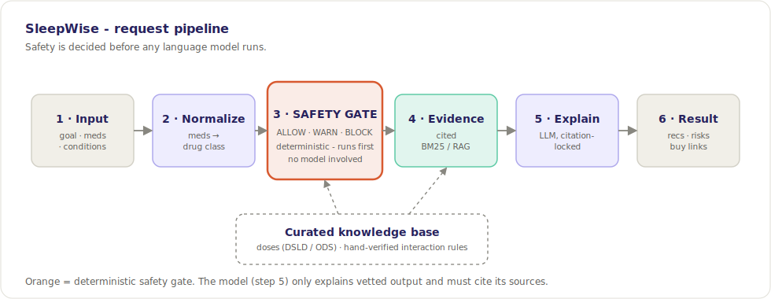

# SleepWise

[](https://sleepwise-90oh.onrender.com)
[](https://github.com/kelvinasiedu-programmer/sleepwise/actions/workflows/ci.yml)

[](https://github.com/astral-sh/ruff)
[](https://mypy-lang.org/)
[](LICENSE)

**A safety-first supplement guidance engine for sleep.** You enter your goal, your
current medications, and a few health flags; SleepWise returns evidence-backed sleep
supplements with doses, citations, **interaction warnings checked by a deterministic
rule engine**, and a clear "talk to a professional" signal when it matters.

> ⚠️ **Not medical advice.** SleepWise surfaces general information from public NIH/FDA
> databases. It is not a diagnosis and not a substitute for a doctor or pharmacist. See
> [Safety & limitations](#safety--limitations).
>
> **Live demo:** **[sleepwise-90oh.onrender.com](https://sleepwise-90oh.onrender.com)** — hosted on Render's free tier, so the first load after idle can take ~50s to wake.

<p align="center">
  
</p>

<!-- Record a short clip, save it as docs/demo.gif, and uncomment:
<p align="center"></p>
-->

## Contents

- [Why this project is interesting](#why-this-project-is-interesting-the-engineering-not-the-supplements)
- [Architecture](#architecture)
- [Tech stack](#tech-stack)
- [Data sources](#data-sources)
- [Quickstart](#quickstart)
- [Configuration](#configuration)
- [Deploy](#deploy)
- [Testing & quality](#testing--quality)
- [Evaluation](#evaluation)
- [Safety & limitations](#safety--limitations)
- [Roadmap](#roadmap)

## Why this project is interesting (the engineering, not the supplements)

Most "AI health" demos let a language model free-associate medical claims. That is
exactly how you hurt someone. SleepWise is built the opposite way:

- **Safety is deterministic, not generative.** Whether two things can be combined is
  decided by a hand-verified rule engine ([`app/safety.py`](app/safety.py)) — *before*
  any model runs. The LLM is only allowed to *explain* the vetted output, never to
  invent or override it.
- **Every claim is grounded, retrieved, and cited.** Evidence is pulled from a curated
  NIH ODS / MedlinePlus corpus by a from-scratch BM25 retriever (RAG) and carried — with
  its citation — all the way to the response.
- **It fails safe.** Unknown med? Pregnancy flag? Prescription sedative? The engine
  escalates to a warning or a hard block and routes you to a clinician.

The design choices are written up in [`DECISIONS.md`](DECISIONS.md), with a longer
narrative in [`docs/CASE_STUDY.md`](docs/CASE_STUDY.md).

## Architecture

The safety layer is the gate: it returns ALLOW / WARN / BLOCK *before* any model runs,
so a hallucination can never reach a safety decision. A curated knowledge base feeds the
safety and evidence stages (see the diagram above).

```
input ─► normalize meds ─► SAFETY GATE ─► evidence ─► LLM explain ─► result
                           ALLOW/WARN/BLOCK
                           (deterministic, first)
```

## Tech stack

| Layer | Choice | Why |
|---|---|---|
| API | FastAPI + Pydantic | Typed request/response, automatic docs at `/docs` |
| Safety | Pure-Python rule engine | Deterministic, unit-testable, no model in the loop |
| Data | Curated JSON from NIH ODS / DSLD / MedlinePlus | Authoritative, citable |
| Med normalization | NIH RxNorm (with offline fallback) | Reliable name → drug-class matching |
| Retrieval (RAG) | From-scratch BM25; optional embeddings | Real retrieval, zero-dependency default |
| Explanation | Optional LLM (Anthropic) + template fallback | Friendly prose, citation-locked |
| Quality | Ruff · mypy · pytest + coverage · CI | Enforced on every push |
| Evaluation | recall@k/MRR · safety · faithfulness | Scorecard fails CI on regression |

## Data sources

- [NIH Office of Dietary Supplements – Fact Sheets API](https://ods.od.nih.gov/api/)
- [Dietary Supplement Label Database (DSLD) API](https://dsld.od.nih.gov/api-guide)
- [MedlinePlus Herbs & Supplements](https://medlineplus.gov/druginfo/herb_All.html)
- [openFDA Drug Label API](https://open.fda.gov/apis/drug/label/)
- [NIH RxNorm (RxNav)](https://rxnav.nlm.nih.gov/)

## Quickstart

**Run the app:**

```bash
python -m venv .venv
# Windows: .venv\Scripts\activate     macOS/Linux: source .venv/bin/activate
pip install -r requirements.txt
uvicorn app.main:app --reload
# UI at http://127.0.0.1:8000  ·  API docs at http://127.0.0.1:8000/docs
```

**Develop (tests, lint, types):**

```bash
pip install -r requirements-dev.txt
pytest          # tests + coverage
ruff check .    # lint
ruff format .   # format
mypy app        # types
```

### Example request

```bash
curl -X POST http://127.0.0.1:8000/recommend \
  -H "Content-Type: application/json" \
  -d '{"meds": ["lorazepam"], "conditions": []}'
```

Valerian comes back in `not_recommended` (BLOCK: additive CNS depression with a
benzodiazepine) with no purchase link, while safe options are returned with cited
rationale.

## Configuration

All integrations are **optional** — with no environment variables set, SleepWise runs
fully on BM25 retrieval and the deterministic explanation template (zero keys, zero cost).

| Variable | Default | Effect |
|---|---|---|
| `SLEEPWISE_RETRIEVER` | `bm25` | Set to `embedding` for semantic retrieval (needs `OPENAI_API_KEY`) |
| `OPENAI_API_KEY` | — | Enables the embedding retriever |
| `SLEEPWISE_EMBEDDING_MODEL` | `text-embedding-3-small` | Embedding model |
| `ANTHROPIC_API_KEY` | — | Enables LLM-written explanations (falls back to the template on any error) |
| `SLEEPWISE_LLM_MODEL` | `claude-haiku-4-5` | Explanation model |
| `SLEEPWISE_RATE_LIMIT` / `SLEEPWISE_RATE_WINDOW` | `60` / `60` | Per-IP requests per window (seconds) |
| `SLEEPWISE_CORS_ORIGINS` | `*` | Comma-separated allowed origins |
| `SENTRY_DSN` | — | Enables Sentry error tracking (if `sentry-sdk` is installed) |

## Deploy

**Live instance:** <https://sleepwise-90oh.onrender.com>

The app is a single stateless service — deploy it anywhere.

**Render (one click):** push to GitHub, then on Render choose **New + → Blueprint** and
select this repo. [`render.yaml`](render.yaml) provisions a free web service with a
`/health` check and auto-deploy on push.

**Docker (Railway / Fly / Cloud Run / anywhere):**

```bash
docker build -t sleepwise .
docker run -p 8000:8000 sleepwise   # http://localhost:8000
```

The image is a slim multi-stage build that runs as a non-root user, honors the host's
`$PORT`, and ships a container `HEALTHCHECK` against `/health`.

## Testing & quality

Every push runs a three-stage GitHub Actions pipeline:

- **Lint & format** — `ruff check` + `ruff format --check`
- **Type check** — `mypy app` (zero issues required)
- **Test** — `pytest` across **Python 3.10 – 3.13** with a **coverage gate (≥ 90%)**

The tests encode the requirement that matters most — the dangerous pairs:

- valerian + benzodiazepine → **BLOCK**
- melatonin + anticoagulant → **WARN**
- magnesium + quinolone antibiotic → **WARN**
- magnesium + kidney disease → **BLOCK**
- ashwagandha in pregnancy → **BLOCK**
- clean profile → **ALLOW**

If a future change ever lets a known-dangerous pair through, a test fails. Dependencies
are kept current by Dependabot; local hygiene is enforced by `pre-commit`.

## Evaluation

`python -m evals.run` prints a scorecard and **fails CI if any metric regresses**. It runs
on the deterministic explanation path, so it's reproducible with no API keys.

| Metric | What it checks | Current |
|---|---|---|
| Retrieval recall@3 / MRR | Does BM25 surface the right evidence chunk? | 1.00 / 1.00 |
| Safety rule accuracy | Do known profiles get the expected ALLOW/WARN/BLOCK? | 100% |
| Explanation coverage | Does the explanation include every cited fact? | 100% |
| Hallucinated numbers | Doses/numbers in the prose absent from the sources | 0 |

The faithfulness checks (coverage + hallucinated-number detection) are the guardrail for
the optional LLM path: if a model ever invents a dose, the harness catches it.

## Safety & limitations

- This is an **educational tool**, not a clinician. It never diagnoses or prescribes.
- The interaction table is **hand-curated for six sleep supplements** against common
  drug classes. It is intentionally narrow and is **not** a complete interaction
  database. Absence of a warning is **not** proof of safety.
- Medication matching is exact-string on generic names; brand names are out of scope in
  v1 (a known limitation — see [`DECISIONS.md`](DECISIONS.md) and the roadmap).
- Data entries are tagged with `verified`; unverified rows must be checked against their
  cited source before any real-world use.
- No personal health data is stored — requests are stateless by design.

## Roadmap

- [x] RAG evidence retrieval — from-scratch BM25 default, optional embedding backend
- [x] Optional LLM explanations (Anthropic) with deterministic citation-locked fallback
- [x] Evaluation harness — retrieval recall@k/MRR, safety scorecard, faithfulness (in CI)
- [x] Deploy config (Render blueprint + Docker) — see [Deploy](#deploy)
- [x] Host the live demo — [sleepwise-90oh.onrender.com](https://sleepwise-90oh.onrender.com)
- [ ] Brand-name + live RxNorm/RxClass drug-class resolution
- [ ] Model additive effects across recommended supplements (e.g. stacked sedatives)
- [ ] Semantic embeddings over the full ODS + MedlinePlus corpus
- [ ] Expand beyond sleep (one goal module at a time)
- [ ] Affiliate links with FTC-compliant disclosure

## License

MIT © Kelvin Asiedu
