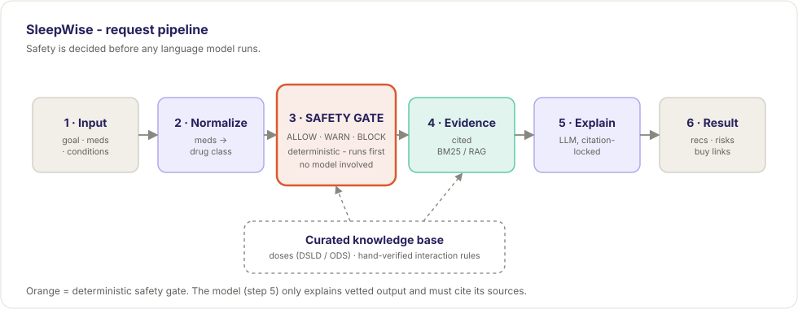
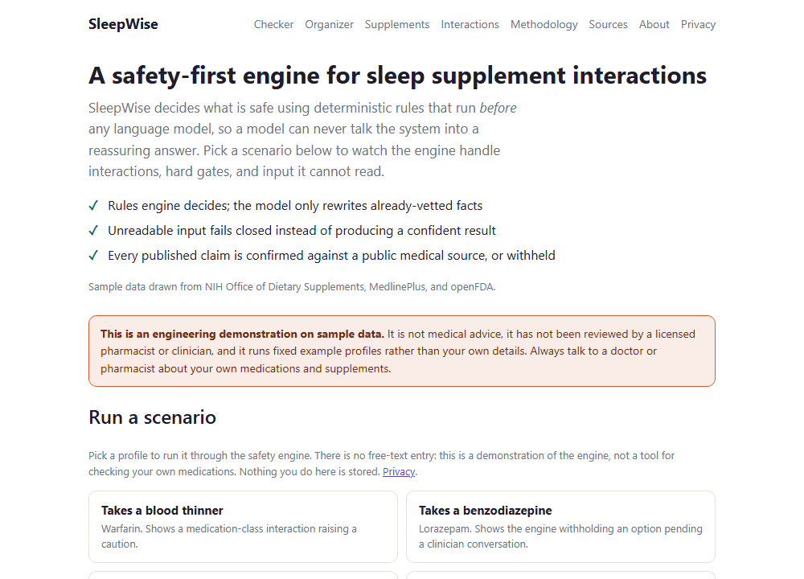

# SleepWise

[](https://sleepwise-90oh.onrender.com)
[](https://github.com/kelvinasiedu-programmer/sleepwise/actions/workflows/ci.yml)
[](https://github.com/kelvinasiedu-programmer/sleepwise/actions/workflows/codeql.yml)

[](https://github.com/astral-sh/ruff)
[](https://mypy-lang.org/)
[](LICENSE)

**How do you build an AI health tool that cannot give unsafe advice?**

SleepWise is a working answer to that question: two deterministic safety engines for the
sleep domain, where the rules decide and a language model is never allowed near a safety
call. It is an engineering demonstration, not a consumer health product, and the
difference is structural rather than a disclaimer - see [What this is](#what-this-is).

> **Live demo:** **[sleepwise-90oh.onrender.com](https://sleepwise-90oh.onrender.com)**
> Hosted on Render's free tier, so the first load after idle takes ~50s to wake.

<p align="center">
  
</p>

<p align="center">
  
</p>

<p align="center"><sub>Regenerate with <code>python scripts/record_demo.py</code> - scripted, not screen-recorded, so it cannot go stale.</sub></p>

## Contents

- [What this is](#what-this-is)
- [The core idea](#the-core-idea)
- [Two engines](#two-engines)
- [What an external review found](#what-an-external-review-found)
- [Tech stack](#tech-stack)
- [Quickstart](#quickstart)
- [Configuration](#configuration)
- [Deploy](#deploy)
- [Testing & quality](#testing--quality)
- [Evaluation](#evaluation)
- [Safety, evidence & limitations](#safety-evidence--limitations)
- [Roadmap](#roadmap)

## What this is

An **engineering demonstration on sample data**. It has not been reviewed by a licensed
pharmacist or clinician, and it is not built to guide anyone's health decisions.

That framing is enforced by the design, not by a banner:

- The checker takes **no free-text health input at all**. It runs ten fixed scenario
  profiles, so the page cannot be used to look up your own medications.
- The symptom organizer accepts **only fixed card IDs**, so no identifying information
  can reach the server.
- Nothing is stored. No accounts, no database, no health data in logs.
- Commerce is switched off entirely: a buying prompt does not belong next to guidance
  nothing has clinically validated.

The data is illustrative, labelled as such, and a
[clinical review packet](docs/CLINICAL_REVIEW_PACKET.md) is prepared for the pharmacist
review that would be required before any of it guided a real decision.

## The core idea

Most "AI health" demos hand the question to a model and print what comes back. That is
fine for a toy and dangerous the moment the answer touches medication. SleepWise inverts
it:

- **Safety is deterministic and runs first.** Whether two things can be combined is
  decided by a rule engine ([`app/safety.py`](app/safety.py)) *before* any model runs. The
  LLM may only restate already-vetted facts, and cannot invent or override one.
- **It fails closed.** An unrecognized medication, an ambiguous entry ("warfarin
  lorazepam" in one field), or an unknown supplement makes the profile *incomplete* and
  withholds the personalized verdict entirely. A missed match must never surface as a
  reassuring result.
- **Unconfirmed claims are withheld.** Every claim records whether it was confirmed
  against its cited source; unconfirmed ones are not published and never enter the
  structured data. Where nothing is confirmed, the page says so instead of filling space.
- **Except warnings, which are labelled rather than hidden.** Deleting a plausible
  caution to tidy up a citation would make the tool less safe for the person who needs
  it. See [`editorial policy`](https://sleepwise-90oh.onrender.com/editorial-policy).

Reasoning is written up in [`DECISIONS.md`](DECISIONS.md), with a narrative in
[`docs/CASE_STUDY.md`](docs/CASE_STUDY.md).

## Two engines

Both are deterministic, rule-driven, and covered by tests that encode the safety
requirements rather than the implementation.

**1. Interaction checker** (`/`) - maps medications to drug classes, evaluates them
against a curated interaction table, applies global hard gates (pregnancy, breastfeeding,
under 18, kidney disease), and runs an additive-sedation pass against what the user
already takes.

```
input ─► resolve meds ─► SAFETY GATE ─► evidence (RAG) ─► LLM explain ─► result
                         ALLOW/WARN/BLOCK          deterministic, first
```

**2. Symptom organizer** (`/organizer`) - answers fixed cards into unranked topics to
raise with a clinician, each showing why it appeared and what to ask.

```
cards ─► RED FLAGS ─► topic rules ─► unranked topics + questions
         escalation first
```

The organizer never ranks, scores, or expresses a likelihood; never asserts or excludes a
condition; treats "not sure" as *not* a match; and escalates before anything that could
read as reassurance. Every one of those is a test in
[`tests/test_symptoms.py`](tests/test_symptoms.py).

## What an external review found

The project was put through a hostile third-party review that reproduced findings against
the live service. It found four real safety defects, all since fixed with regression
tests:

| Defect | Effect | Fix |
|---|---|---|
| Multi-entity input resolved to the first match | `"warfarin lorazepam"` silently dropped lorazepam and returned a confident result missing a benzodiazepine interaction | Resolution returns every match and refuses to guess (new `ambiguous` state) |
| Kidney disease was not a hard gate | Non-magnesium items came back clean | Global hard gate + condition alias normalization |
| `current_supplements` accepted then ignored | Unknown entries produced personalized output | Resolved against the catalog; unknown ⇒ incomplete |
| Sedation stacking computed across candidates | Warnings unrelated to the user's input | Computed against the reported stack only |

It also found that only ~12 of 27 sampled claims were directly supported by the page they
cited, which is what prompted the publication gate above. The
[audit trail is in the commit history](https://github.com/kelvinasiedu-programmer/sleepwise/commits/main).

## Tech stack

| Layer | Choice | Why |
|---|---|---|
| API | FastAPI + Pydantic | Typed contracts, automatic docs at `/docs` |
| Safety | Pure-Python rule engines | Deterministic, unit-testable, no model in the loop |
| Data | Curated JSON from NIH ODS / MedlinePlus / NCCIH / openFDA | Public, citable, inspectable |
| Med normalization | Offline drug-class map + brand/dosage/fuzzy/ambiguity handling | Resilient, no network needed |
| Retrieval (RAG) | From-scratch BM25; optional embeddings | Real retrieval, zero-dependency default |
| Explanation | Optional LLM (Anthropic) + template fallback | Friendly prose, citation-locked |
| Frontend | Vanilla JS, no build step | DOM built with `textContent` only; no XSS surface |
| Quality | Ruff · mypy · pytest + coverage · CodeQL · pip-audit | Enforced on every push |
| Evaluation | recall@k/MRR · safety · faithfulness · claim linter | Scorecard fails CI on regression |

## Quickstart

```bash
python -m venv .venv
# Windows: .venv\Scripts\activate     macOS/Linux: source .venv/bin/activate
pip install -r requirements.txt
uvicorn app.main:app --reload
# UI at http://127.0.0.1:8000  ·  API docs at http://127.0.0.1:8000/docs
```

**Develop:**

```bash
pip install -r requirements-dev.txt
pytest            # tests + coverage gate
ruff check .      # lint
mypy app          # types
python -m evals.run   # evaluation scorecard
```

### Try the engine directly

The UI runs fixed scenarios, but the API is open - inspecting the engine is the point of
the project.

```bash
# A benzodiazepine user: valerian is withheld pending a clinician
curl -X POST http://127.0.0.1:8000/recommend \
  -H "Content-Type: application/json" \
  -d '{"meds": ["lorazepam"]}'

# Two drugs in one field: the engine refuses to guess
curl -X POST http://127.0.0.1:8000/recommend \
  -H "Content-Type: application/json" \
  -d '{"meds": ["warfarin lorazepam"]}'   # -> profile_status: "incomplete"
```

## Configuration

All integrations are **optional**. With no environment variables set, SleepWise runs
fully on BM25 retrieval and the deterministic explanation template - zero keys, zero cost.

| Variable | Default | Effect |
|---|---|---|
| `SLEEPWISE_RETRIEVER` | `bm25` | Set to `embedding` for semantic retrieval (needs `OPENAI_API_KEY`) |
| `OPENAI_API_KEY` | - | Enables the embedding retriever |
| `ANTHROPIC_API_KEY` | - | Enables LLM-written explanations (falls back to the template on any error) |
| `SLEEPWISE_LLM_MODEL` | `claude-haiku-4-5` | Explanation model |
| `SLEEPWISE_RATE_LIMIT` / `SLEEPWISE_RATE_WINDOW` | `60` / `60` | Per-IP requests per window (seconds) |
| `SLEEPWISE_CORS_ORIGINS` | *(empty)* | Comma-separated origins. Empty means same-origin only |
| `SENTRY_DSN` | - | Enables Sentry error tracking (if `sentry-sdk` is installed) |

## Deploy

**Live instance:** <https://sleepwise-90oh.onrender.com>

A single stateless service - deploy it anywhere.

**Render (one click):** push to GitHub, then choose **New + → Blueprint** and select this
repo. [`render.yaml`](render.yaml) provisions a free web service with a `/health` check
and auto-deploy on push.

**Docker:**

```bash
docker build -t sleepwise .
docker run -p 8000:8000 sleepwise
```

Slim multi-stage build, non-root user, honors `$PORT`, ships a container `HEALTHCHECK`.

## Testing & quality

**107 tests, ~96% coverage.** Every push runs:

- **Lint & format** - `ruff check` + `ruff format --check`
- **Type check** - `mypy app`, zero issues required
- **Test** - `pytest` across **Python 3.10 - 3.13** with a **coverage gate (≥ 90%)**
- **Evaluation** - the [scorecard](#evaluation), which fails the build on regression
- **Dependency audit** - `pip-audit` on runtime dependencies
- **CodeQL** - static security analysis, on every push and weekly
- **Citations** - every cited URL checked for reachability, weekly and on data changes

The tests encode requirements, not implementation. A change that lets any of these
through goes red:

- valerian + benzodiazepine → **withheld**
- two medications in one field → **incomplete**, never a confident result
- kidney disease → every option defers, no exceptions
- pregnancy / breastfeeding / under 18 → global hard gate
- unrecognized medication or supplement → **incomplete**
- a purchase link appearing anywhere → **fails**
- symptom organizer emitting a percentage, a ranking, or "you have" → **fails**

## Evaluation

`python -m evals.run` prints a scorecard and **fails CI on any regression**. It runs on
the deterministic path, so it reproduces with no API keys.

| Metric | What it checks | Current |
|---|---|---|
| Retrieval recall@3 / MRR | Does BM25 surface the right evidence chunk? | 1.00 / 1.00 |
| Safety rule accuracy | Do known profiles get the expected outcome? | 100% |
| Explanation coverage | Does the explanation include every cited fact? | 100% |
| Hallucinated numbers | Doses in the prose absent from the sources | 0 |
| Definitive-claim phrases | Language that would overstate certainty | 0 |

The faithfulness checks are the guardrail for the optional LLM path: if a model ever
invents a dose, the harness catches it before a human would.

## Safety, evidence & limitations

Stated plainly, because a demonstration that hides its edges is not a good demonstration.

- **No licensed review.** No pharmacist or clinician has reviewed the data. The
  [review packet](docs/CLINICAL_REVIEW_PACKET.md) exists for when one does.
- **Sample data.** The interaction table covers six sleep supplements against common drug
  classes. It is narrow by design and is **not** an interaction database. Absence of a
  warning is not proof of safety.
- **Citations are database-level, not claim-level.** A link means "this is the public
  source this topic draws from", not "this exact sentence appears there". Claims not
  confirmed against their source are withheld from display.
- **Matching is not exhaustive.** Generic names, common brands, embedded dosages, typos,
  and multi-drug ambiguity are handled; live RxNorm resolution is the planned upgrade.
- **No personal health data is stored.** Stateless by design; the symptom organizer keeps
  answers in the browser tab only.

## Roadmap

- [x] RAG evidence retrieval - from-scratch BM25, optional embedding backend
- [x] Optional LLM explanations with a deterministic citation-locked fallback
- [x] Evaluation harness in CI - retrieval, safety, faithfulness, claim linter
- [x] Deployed live (Render blueprint + Docker)
- [x] Brand-name, dosage, fuzzy, and ambiguous medication handling
- [x] Additive-sedation check against the user's actual stack
- [x] Fail-closed profile states and commerce removal
- [x] Publication gate withholding unconfirmed claims
- [x] Symptom organizer with red-flag escalation
- [ ] Licensed pharmacist review of the interaction table and dose ranges
- [ ] Live RxNorm/RxClass drug-class resolution
- [ ] Claim-level, section-anchored citations

## License

MIT © Kelvin Asiedu
